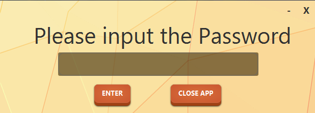
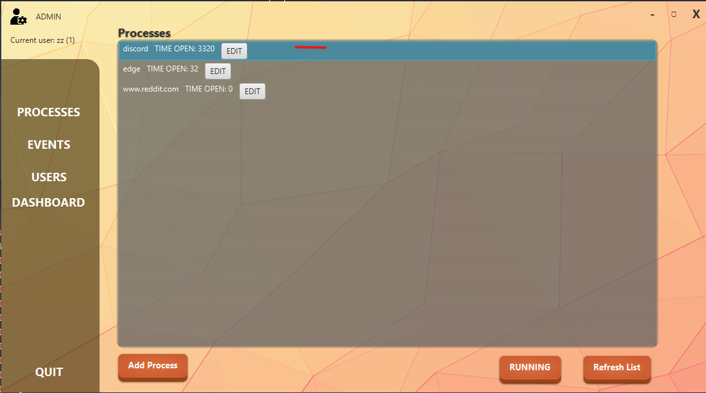
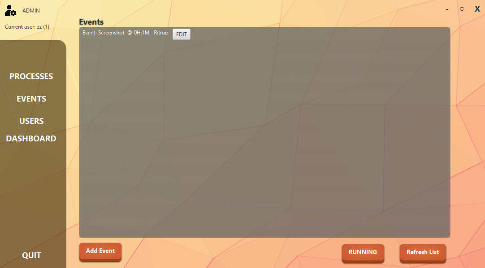
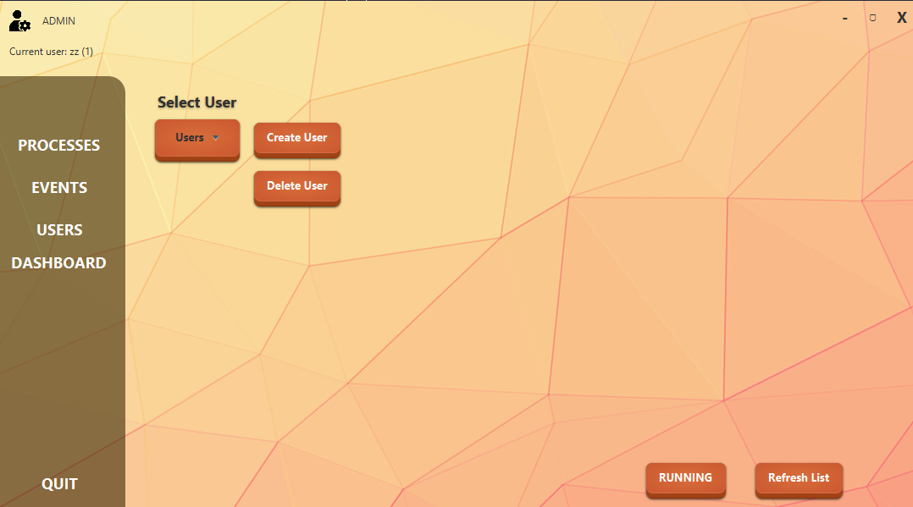
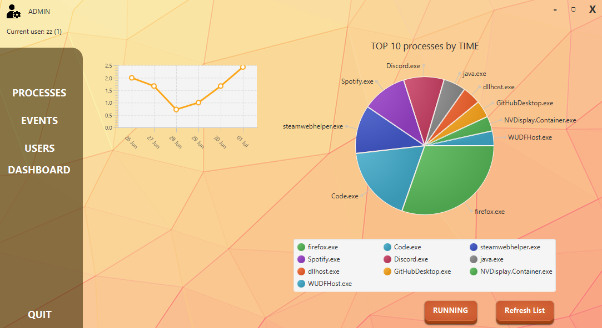

## Description

A Desktop application that allows users to monitor, track, and limit the execution time of specific processes on their system. It includes a real-time background service that automatically terminates processes exceeding their allowed usage time.

## Goals

- [x] Create and edit users
- [x] Add processes and urls to track for each user
- [x] Create and Edit system events
- [x] Track time for each process
- [x] Edit processes
- [x] Stop process from running when reaching a time limit
- [x] Stop webpage from running
- [x] User interface
- [x] Lock system after x hour
- [x] Show app in system tray
- [x] Run at startup without requiring admin password (does not allow modifications without the password)
- [x] Admin password required to change settings or to close the app
- [x] Dashboard showing the most used processes and daily use time

## Setup

> Make sure you have Java 21+ and Maven installed and properly configured in your environment.
>
> Make sure you have [Maven](https://maven.apache.org/install.html) installed and properly configured on your system.

1. Clone de repository

```commandline
    git clone https://github.com/zKlau/ParentalControl.git
    cd ParentalControl
```

2. Build the Project

```commandline
    mvn clean install
```

3. Run the application

```commandline
    mvn javafx:run
```

## PRESENTATION

On first boot, you will be required to create an admin password and a user.

On future runs, only the admin password will be required.

The first page the admin sees is the processes page. Here, the admin can add Windows processes or website URLs. You can set a time limit for these processes so that after using an app for a certain amount of time, it will automatically close. For URLs, you can block them completely without requiring a time limit. A time limit of 0 means no time limit.

Adding a process is as easy as selecting the executable or simply typing in the app name. For URLs, just input the website address, like www.zklau.com.

The next page is the events page. Here, you can add events that will occur occasionally or just one time.

This window allows you to set the event type, hour, and minute. To make sure the event runs at a specific hour, select "Event running at". If you want the event to run after some time, select "Event running after". Pressing the repeat button will make sure the event repeats and is not deleted after its first run.

The third page shows user creation and deletion.


The last page displays important information about the time spent on the computer. Here, you can see how many hours have been spent each day and how many total hours the user has in a specific app.


The full JavaDoc is available in [Main.html](resources/doc/Main.html)
